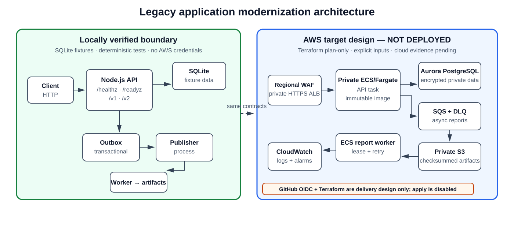

# Legacy Application Modernization

An evidence-led modernization of a deliberately constrained Node.js Order
Reference Service. The project shows how to move from a testable monolith to
an operable, security-conscious container and AWS target without pretending
that a plan is a deployment.

## What this demonstrates

- A preserved `/v1` HTTP contract with validation, idempotency, ownership,
  transitions, reports, correlation IDs, and safe error envelopes.
- Node 24 application seams for SQLite, PostgreSQL, JWT validation, SQS, S3,
  asynchronous report jobs, telemetry, and graceful shutdown.
- A non-root, read-only container with immutable image input, health/readiness
  boundaries, CA provenance, and process-specific runtime contracts.
- Plan-only Terraform for private networking, ECS/Fargate, Aurora, ECR, S3,
  SQS/DLQ, WAF, Cognito metadata, KMS, CloudWatch, autoscaling, and constrained
  GitHub OIDC design.
- Operational runbooks and deterministic evidence for recovery, backup/restore,
  worker failure paths, cost sensitivity, and publication boundaries.

## Architecture

The architecture board below separates locally verified behavior from the AWS
target design. AWS resources, credentials, and deployment execution are not
claimed; the target is represented by plan-only Terraform and explicit inputs.



The maintainable diagram source is
[`docs/diagrams/target-architecture.mmd`](docs/diagrams/target-architecture.mmd).

CloudFront is an optional edge layer with a separate us-east-1 certificate.
The direct Terraform target remains private and requires explicit regional
certificate inputs and an immutable container digest.

## Status and evidence

Waves 0–3 are implemented and locally accepted. The merged main CI run
[`31628031475`](https://github.com/abdalrahmanattya/legacy-application-modernization/actions/runs/31628031475)
covered the Node suite, Wave3 tests, container build/acceptance, Trivy image
checks, SBOM generation, disposable PostgreSQL integration, recovery, and
backup/restore evidence. The repository has no hosted application endpoint.

The evidence matrix classifies each result as specified, structurally reviewed,
locally verified, hosted verified, or cloud verified. AWS services, credentials,
production data, RDS failover/PITR, ECS rollback, SQS redrive, WAF/ACM delivery,
OIDC trust, and regional recovery remain cloud-unverified. The apply workflow is
intentionally disabled.

See:

- [HTTP contract](docs/api/order-reference-contract.md)
- [Architecture](docs/architecture.md)
- [Runtime contract](docs/application-runtime-contract.md)
- [Security](docs/security.md)
- [Threat model](docs/threat-model.md)
- [Evidence matrix](docs/evidence/evidence-matrix.md)
- [Wave 3 operations and recovery](docs/wave3/operations-and-recovery.md)
- [Wave 3 exit and go/no-go](docs/wave3/exit-and-go-no-go.md)

## Run locally

Node `>=24 <25` is required.

```sh
npm ci
npm run reset
npm run seed
npm test
npm run test:wave3
npm run lint
npm run format
npm audit --audit-level=high
ENVIRONMENT=local npm start
```

The service listens on port 3000. `GET /healthz` is liveness and `GET /readyz`
is readiness. The local-only UI is available at `/`; it is not the canonical
API. Compose provides a disposable SQLite container boundary:

```sh
docker build -t order-reference-service:local .
docker compose up --build -d
curl http://127.0.0.1:3000/readyz
docker compose down
```

## Production-shaped modes

The same image has separate API, migration, outbox-publisher, and report-worker
commands. Production mode requires PostgreSQL with verified TLS, JWT identity,
raw secret injection, process-specific SQS/S3 settings, and a separately
controlled migration task. See the [runtime contract](docs/application-runtime-contract.md).

Terraform under `infra/` is a reviewable, non-applied target. Use Terraform
1.15.8, backend-disabled validation, and an explicit immutable image digest.
Do not apply it without separate approval, a reviewed state backend, protected
deployment environment, certificate ARNs, secret bootstrap, and cloud recovery
plan.

## Provenance and licensing

This is an original successor project. The historical repository is referenced
only for migration context; application artifacts and generated cloud files
were not copied. The repository is licensed under the [MIT License](LICENSE).
`package.json` retains `private: true` intentionally: this is a portfolio
repository, not an npm package publication target.

See [CONTRIBUTING.md](CONTRIBUTING.md) and [SECURITY.md](SECURITY.md) before
opening a change.
