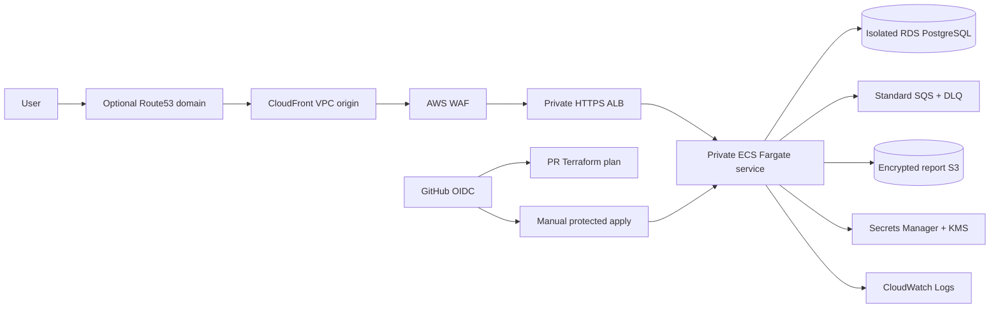

# Wave 2 architecture and delivery design

The diagram is a design only. CloudFront VPC origins/private ALB constraints,
TLS certificates, WAF association, Cognito integration, and endpoint routing
must be validated in an approved AWS account before any claim of operation.
Authentication is group-based (`operator`/`admin`) through Cognito JWT access
tokens. Resource-server scopes are metadata only until application enforcement;
the no-secret client has no hosted UI, OAuth callback, or auth-code claim.
Nonprod is single-AZ and cost-conscious; prod is Multi-AZ. No long-lived AWS
keys are permitted. Build once, promote one immutable image digest, retain an
SBOM, and choose keyless Sigstore signing before production delivery.
